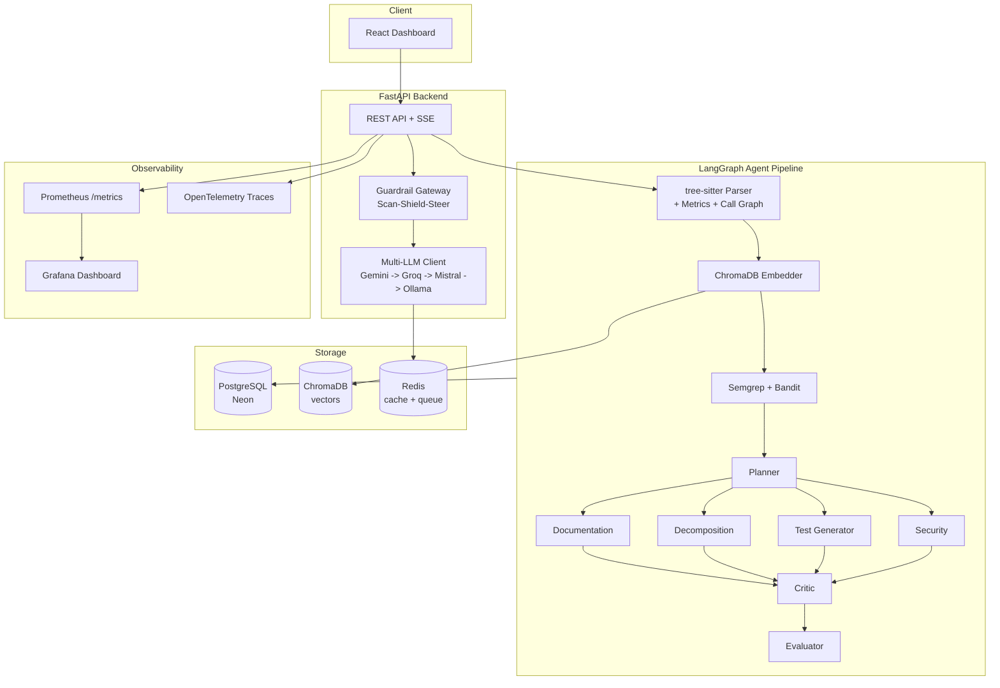
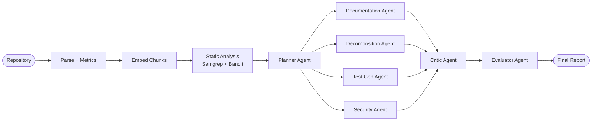

# Atlas — Agentic AI Legacy Modernization Platform


Technical debt costs enterprises **$1.52 trillion annually** (CAST Research),
and 76% of enterprise applications are classified as legacy. A manual
modernization assessment of a 500K-line codebase takes 6-12 months. Atlas
automates that assessment into a 6-agent pipeline that runs in hours, not
months — directly aligned with Infosys's **Agentic Legacy Modernization**
value pool (the same class of problem Infosys solved for Hertz, migrating
~3 million lines of legacy code, per Infosys Investor Day 2026), built on
the same architectural pattern as Infosys's open-source Agentic Foundry
(FastAPI + agent orchestration + LLM gateway) and Responsible AI Toolkit
(Scan-Shield-Steer / AI3S).

Given a legacy repository, Atlas parses it into an AST and call graph,
indexes it for RAG, and runs 6 coordinated AI agents (LangGraph-orchestrated,
guardrail-wrapped) to produce: architecture documentation, a microservices
decomposition plan, generated unit tests, an OWASP Top 10 security report,
a complexity/technical-debt dashboard, and an LLM-as-judge evaluation of its
own output quality — all on 100% free-tier infrastructure.

## Live Demo

**[DEMO LINK]** — pre-computed results load in under 2 seconds; a live
analysis of a small sample app also runs end-to-end in under 3 minutes.

## Architecture



## Agent Pipeline



## Features

- [x] 6-agent Planner-Executor-Critic pipeline (LangGraph, checkpointed)
- [x] Responsible-AI Guardrail Gateway (Scan-Shield-Steer pattern)
- [x] Multi-LLM fallback gateway (Gemini -> Groq -> Mistral -> Ollama)
- [x] tree-sitter AST parsing (Python + Java, extensible to JS/TS)
- [x] Cyclomatic complexity, coupling, and cohesion metrics
- [x] OWASP Top 10 detection (Semgrep + Bandit static analysis, LLM-enriched)
- [x] Microservices decomposition via DDD + dependency-graph coupling
- [x] Unit test generation (pytest / JUnit)
- [x] LLM response caching (Redis, 24h TTL) + exponential backoff on rate limits
- [x] Real-time job progress via Server-Sent Events
- [x] Interactive React Flow call-graph and microservices diagrams
- [x] LLM-as-judge evaluation harness (faithfulness, completeness, actionability)
- [x] Full observability: Prometheus metrics, structured JSON logs, OpenTelemetry traces
- [x] 100% free-tier deployable (Neon + Upstash + Railway + Vercel)

## Tech Stack

| Layer | Technology |
|---|---|
| Backend | [FastAPI](https://fastapi.tiangolo.com/), [SQLAlchemy 2.0](https://www.sqlalchemy.org/) (async), [Alembic](https://alembic.sqlalchemy.org/) |
| Agent orchestration | [LangGraph](https://langchain-ai.github.io/langgraph/), [LiteLLM](https://litellm.ai/) |
| LLM providers | [Gemini 1.5 Flash](https://ai.google.dev/), [Groq](https://groq.com/) (Llama 3.3), [Mistral Codestral](https://mistral.ai/) |
| Parsing | [tree-sitter](https://tree-sitter.github.io/tree-sitter/) |
| Vector store | [ChromaDB](https://www.trychroma.com/) |
| Static analysis | [Semgrep](https://semgrep.dev/), [Bandit](https://bandit.readthedocs.io/) |
| Guardrails | [Presidio](https://microsoft.github.io/presidio/) (PII), custom prompt-injection + grounding checks |
| Task queue | [Celery](https://docs.celeryq.dev/) + Redis |
| Frontend | [React 18](https://react.dev/), [Vite](https://vitejs.dev/), [Tailwind CSS](https://tailwindcss.com/), [React Flow](https://reactflow.dev/) |
| Database | [PostgreSQL 15](https://www.postgresql.org/) (via [Neon](https://neon.tech/) in production) |
| Observability | [Prometheus](https://prometheus.io/), [Grafana](https://grafana.com/), [OpenTelemetry](https://opentelemetry.io/) |

## Quick Start

```bash
git clone https://github.com/<username>/atlas
cd atlas
cp backend/.env.example backend/.env   # add your free API keys
docker compose up --build
python backend/seed_demo_data.py       # seeds demo data + runs one live analysis
```

- API docs: http://localhost:8000/docs
- Frontend: http://localhost:5173
- Demo login: `demo@atlas.ai` / `DemoAtlas2024!`

See [docs/DEPLOYMENT.md](docs/DEPLOYMENT.md) for the free-tier production
deployment (Railway + Vercel + Neon + Upstash).

## Documentation

- [Architecture](docs/ARCHITECTURE.md) — full system design, data flow, schema
- [API Reference](docs/API.md) — endpoint reference
- [Interview Guide](docs/INTERVIEW_GUIDE.md) — talking points, whiteboard guide

## Business Case

- **$1.52 trillion**: annual cost of technical debt across enterprises (CAST Research, 2024)
- **76%**: share of enterprise applications classified as legacy
- **6-12 months**: typical manual modernization assessment for a 500K-line codebase
- **Hours**: Atlas's automated assessment for the same scope
- Directly aligned with Infosys's **Agentic Legacy Modernization** value pool
  (one of six named AI value pools, targeting a $300-400B incremental AI
  services opportunity by 2030) — the same class of problem Infosys solved
  for Hertz, migrating ~3 million lines of legacy code (Infosys Investor Day,
  Feb 2026)

## Roadmap

- [ ] COBOL -> Java migration agent
- [ ] Agent-to-Agent (A2A) protocol support for multi-repo analysis
- [ ] Fine-tuned small language model for code analysis (no external API dependency)
- [ ] VS Code extension (IDE-native findings)
- [ ] GitHub App integration (PR-triggered analysis)

## License

MIT
