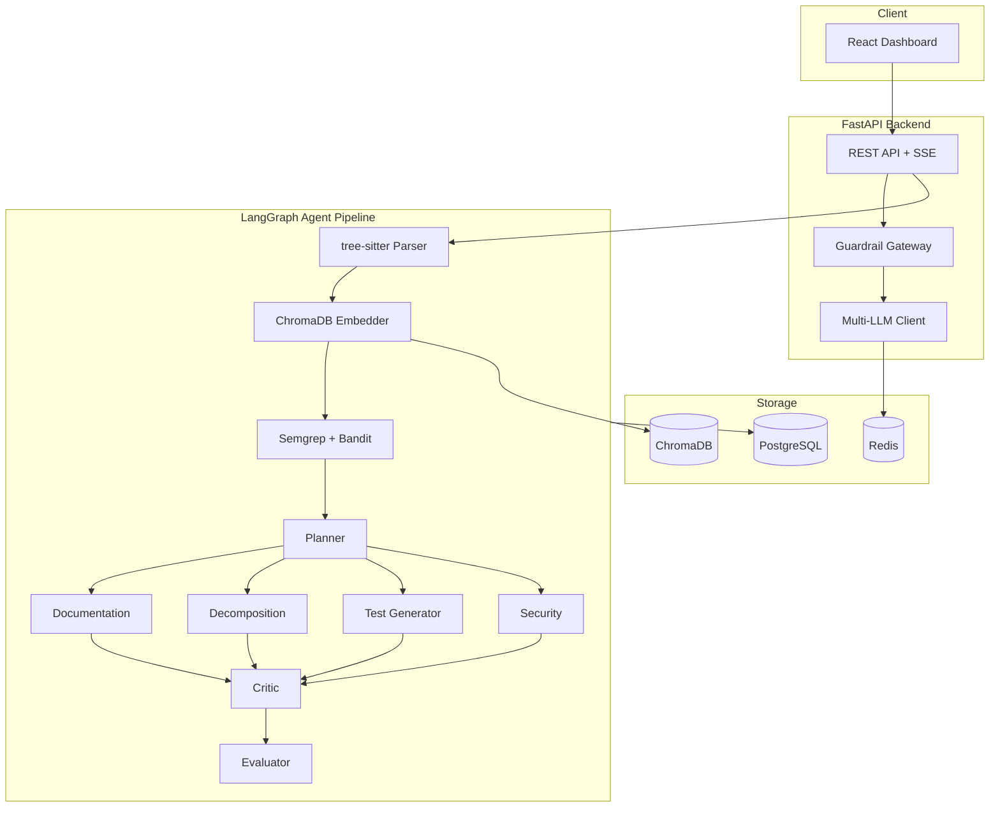
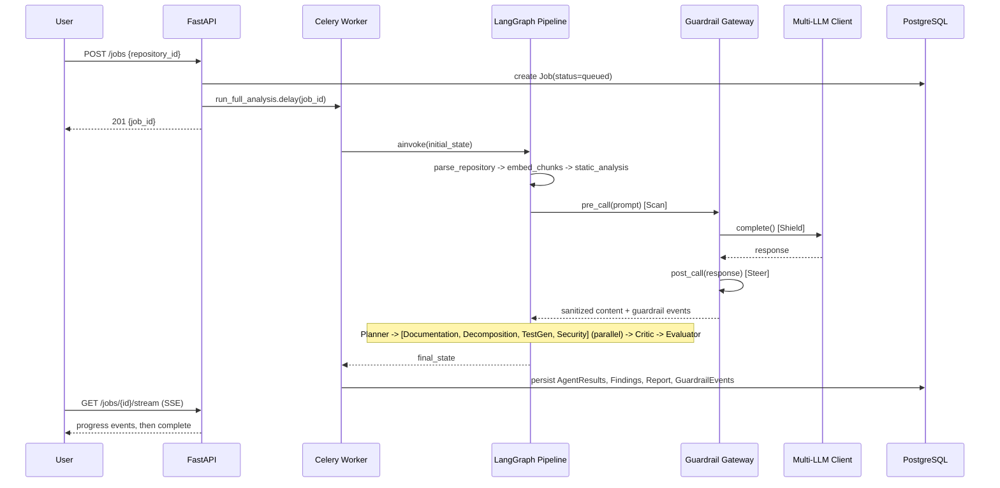

# Atlas Architecture

## Overview

Atlas ingests a legacy repository (ZIP upload or public GitHub URL), parses
it with tree-sitter, indexes it into ChromaDB for RAG, and runs a 6-agent
LangGraph pipeline to produce architecture documentation, a microservices
decomposition plan, generated tests, an OWASP-mapped security report, a
quality/complexity dashboard, and an LLM-as-judge evaluation of the other
agents' own output.

## System Diagram

## Data Flow: One Analysis Job

## Database Schema

`User` (1) -> (N) `Project` -> (N) `Repository` -> (N) `CodeFile` -> (N) `CodeChunk`

`Project` (1) -> (N) `Job` -> (N) `AgentResult` -> (N) `Finding`

`Repository` (1) -> (N) `CallGraphEdge`

`Job` (1) -> (N) `GuardrailEvent`, (N) `Report`

See `backend/alembic/versions/001_initial_schema.py` for the full DDL and
`backend/app/models/` for the SQLAlchemy models. Key design choices:

- **JSONB columns** (`agent_results.output`, `findings` metadata, `reports.content_json`,
  `guardrail_events.details`) hold agent-specific structured output without
  forcing every agent's JSON shape into rigid relational columns, while everything
  else stays fully relational (foreign keys, cascade deletes, unique constraints).
- **UUID primary keys** throughout, generated client-side (Python `uuid.uuid4()`),
  avoiding a round-trip to the DB for ID generation and making IDs safe to
  reference before a row is committed.
- **Indexes** on every foreign key used in a hot-path query (`idx_jobs_status`,
  `idx_findings_severity`, etc.) -- see the migration for the full list.

## The Guardrail Gateway (Scan-Shield-Steer)

Every LLM call in Atlas passes through `app/guardrails/gateway.py`:

1. **Scan** (pre-call): prompt-injection pattern matching, PII detection/redaction
   on the outbound prompt, token-budget enforcement.
2. **Shield**: the LLM call itself only happens if Scan allows it.
3. **Steer** (post-call): a grounding check cross-references any file paths or
   function names the LLM cited against the real parsed repository (catches
   hallucinated line numbers/functions), plus a PII scan on the response.

One subtlety worth calling out: PII redaction on a JSON response must never
corrupt the JSON structure the calling agent needs to parse. Presidio's URL
recognizer, for example, can false-positive on a bare filename like `app.py`
(it resembles a domain). The gateway checks whether redaction would break an
otherwise-valid JSON payload and, if so, keeps the original content and just
flags the event for visibility rather than silently corrupting a good response
into a fallback.

## Multi-LLM Fallback

`app/llm/client.py`'s `AtlasLLMClient` tries providers in an agent-specific
priority order (`app/llm/router.py`), with a 20-second per-attempt timeout and
exponential backoff (2^n seconds, capped at 32s) on rate-limit errors. After
`MAX_RETRIES_PER_PROVIDER` consecutive rate limits on one provider, it moves
to the next. If every provider fails (no keys configured, or a genuine outage),
`app/agents/base.py`'s `guarded_complete` catches the exception and every agent
falls back to a deterministic heuristic output rather than crashing the job --
this is what keeps a demo running even if a free-tier quota is exhausted mid-run.

## Complexity & Debt Metrics

- **Cyclomatic complexity**: McCabe's `M = decision_points + 1`, computed by
  walking each function's tree-sitter subtree and counting branch/loop/boolean
  nodes (`app/parser/metrics.py`).
- **Coupling**: `external_calls / total_calls` per file, from the repository-wide
  call graph (`app/parser/call_graph.py`). Below ~0.3 suggests a natural
  bounded-context boundary -- the signal the Decomposition Agent uses to
  propose service extraction order.
- **Technical debt (minutes)**: a weighted sum of dead-code functions,
  high-complexity functions, untested functions, security-critical findings,
  and missing docstrings.

## Observability

- **Metrics**: `/metrics` (Prometheus format) exposes both HTTP-request metrics
  (via `prometheus-fastapi-instrumentator`) and custom business metrics
  (`atlas_jobs_total`, `atlas_agent_duration_seconds`, `atlas_llm_tokens_total`,
  `atlas_guardrail_events_total`, etc. -- see `app/observability/metrics.py`).
- **Logs**: structured JSON via `python-json-logger`, one line per request with
  `{timestamp, level, method, path, status_code, duration_ms}`.
- **Traces**: OpenTelemetry auto-instruments FastAPI; exports via OTLP if
  `OTEL_EXPORTER_OTLP_ENDPOINT` is set (e.g. Grafana Cloud Tempo), otherwise a
  console exporter in local dev so the tracing code path is still exercised.
- **Dashboard**: `grafana/dashboard.json` is a ready-to-import Grafana dashboard
  covering jobs/hour, agent success rate, token consumption, guardrail
  rejection rate, finding severity distribution, API latency percentiles, and
  cache hit rate.
